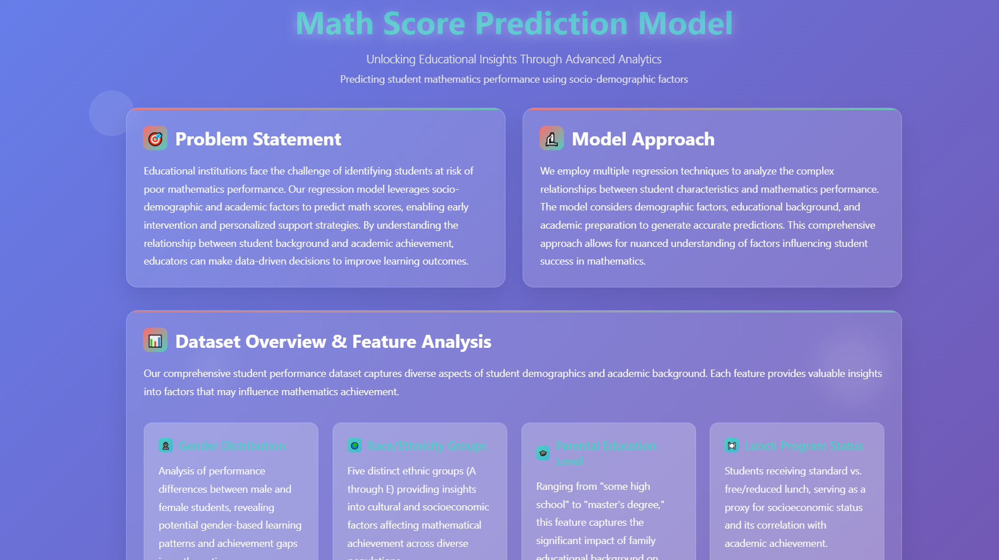
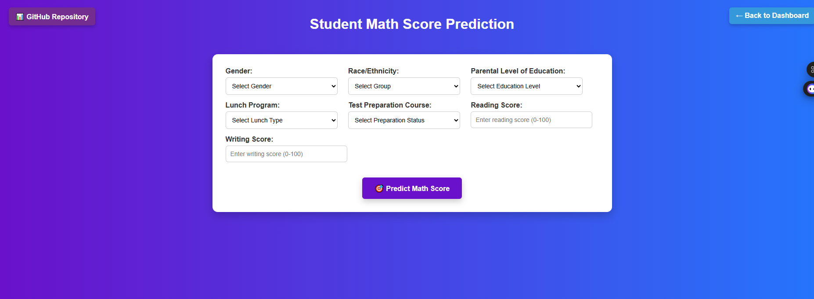

# 📊 Math Score Prediction Model

Unlocking **educational insights** through advanced analytics.  
This project predicts **student mathematics performance** using socio-demographic and academic factors, providing a tool for **early intervention** and **personalized learning strategies**.

---

## 🎯 Problem Statement

  

Educational institutions often struggle to identify students **at risk of poor mathematics performance**.  
Our regression-based model leverages socio-demographic and academic features to predict math scores, enabling educators to:

- Detect students needing additional support.  
- Design personalized learning strategies.  
- Make **data-driven decisions** to improve overall learning outcomes.  

---

## 🔬 Model Approach

- Uses **regression techniques** to model relationships between student characteristics and math performance.  
- Considers **demographics, parental education, lunch program status, test preparation**, and other academic indicators.  
- Provides accurate predictions and interpretable insights into factors influencing mathematics achievement.  

---

## 📂 Dataset Overview & Features

The dataset contains student demographic and academic details. Key features:

- 👤 **Gender** – Male vs Female performance patterns.  
- 🌍 **Race/Ethnicity Groups** – 5 groups (A–E).  
- 🎓 **Parental Education Level** – From "some high school" to "master's degree".  
- 🍽️ **Lunch Program** – Standard vs free/reduced (proxy for socioeconomic status).  
- 📚 **Test Preparation Course** – Completed vs not completed.  
- 📈 **Multi-Subject Scores** – Math, Reading, Writing (for correlation analysis).  

**Stats**:
- `8` features  
- `32+` samples (extendable dataset)  
- Score range: `0–100`  
- `5` ethnic groups  

---

## 🧪 Machine Learning Experiments

To ensure the best predictive performance, we **experimented with multiple regression models**, including:

- Random Forest Regressor  
- Decision Tree Regressor  
- Gradient Boosting Regressor  
- Linear Regression, Ridge, Lasso, ElasticNet  
- K-Nearest Neighbors Regressor  
- XGBoost Regressor  
- CatBoost Regressor  
- AdaBoost Regressor  

We compared models using the **R² Score** as the evaluation metric.  
After initial testing, we applied **hyperparameter tuning** (via `RandomizedSearchCV` and `GridSearchCV`) to optimize performance.  

**Key Results**:  
- Baseline models achieved R² scores between **65%–82%**.  
- After hyperparameter optimization, the **best model** achieved an **R² score of 0.89 (89%)**, significantly improving predictive accuracy.  

This demonstrates the **effectiveness of ensemble methods** (e.g., Random Forest, Gradient Boosting, XGBoost) in handling heterogeneous educational data.  

---

## 🖥️ Application Overview

The web application has **two main pages**:

1. **`index.html`** – Displays the project name and problem statement.  
     

2. **`predict.html`** – A form where users enter student details to predict the math score.  
     

---

## 🛠️ Tech Stack

- **Python** 🐍  
- **Flask** (Web app)  
- **Pandas, NumPy** (Data processing)  
- **Scikit-learn** (ML model building)  
- **Matplotlib, Seaborn** (Visualization)  

---

## 🚀 How to Run the Project

1. Clone the repository:
   ```bash
   
   git clone https://github.com/achraf-bogryn/ML_Project.git
   cd ML_Project
   ```
 2. Install dependencies:
    
    ```bash
    pip install -r requirements.txt
    ```
 3. Run the Flask app:
 
    ```bash
    python app.py
     ```
 4. Open in your browser:

     ```bash
     http://127.0.0.1:5000

     ```
